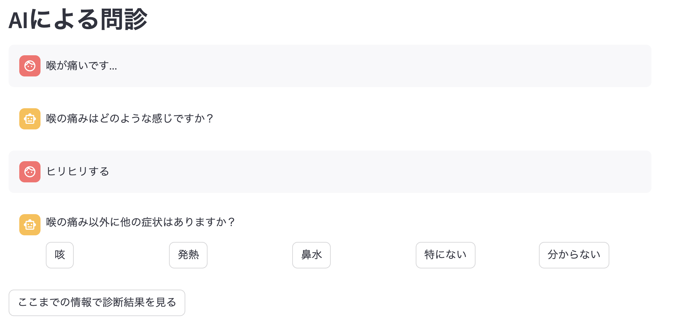

# 🩺 AI問診アシスタント (AI Symptom Checker)



StreamlitとOpenAIの生成AIを活用して開発された、対話型の症状チェックWebアプリケーションです。ユーザーの回答に応じてAIが動的に質問を生成し、考えられる病気の可能性を提示します。

## 概要

このアプリは、体調に不安を抱えるユーザーが、簡単な選択肢に答えていくだけで、症状を深掘りできるツールです。固定の質問ツリーではなく、AIが会話の流れを読んで次の質問を考えるため、より自然でパーソナルな問診体験を提供します。最終的には、可能性の高い病名とその対処法に関するレポートが生成されます。


## 主な機能

- **対話型UI**: チャット形式で直感的に操作できます。
- **AIによる動的な質問生成**: ユーザーの回答履歴を元に、AIが次に聞くべき最適な質問をその場で生成します。
- **複数の可能性を提示**: 可能性のある病名を複数リストアップし、その根拠も合わせて表示します。
- **詳細レポート**: 各病名について、症状の解説、セルフケア、受診の目安などをまとめたレポートをAIが生成します。

## 使用技術

- **フロントエンド**: [Streamlit](https://streamlit.io/)
- **AIモデル**: [OpenAI API (GPT-4o)](https://openai.com/api/)
- **言語**: Python 3.x

## 利用方法

### 1. リポジトリをクローン

```bash
git clone https://github.com/wkawabe/ai_diagnosis.git
cd ai_diagnosis
```

### 2. 必要なライブラリをインストール

以下のコマンドで必要なライブラリをインストールします。

```bash
pip install -r requirements.txt
```


### 3. OpenAI APIキーの設定

アプリを実行するにはOpenAIのAPIキーが必要です。アプリ画面のサイドバーから入力するか、より安全な方法として環境変数を設定することもできます。

### 4. アプリケーションの実行
以下のコマンドをターミナルで実行します。

```bash
streamlit run advanced_app.py
```

ブラウザで http://localhost:8501 が自動的に開かれ、アプリケーションが起動します。

## ⚠️ 重要: 免責事項
このアプリケーションは、医療的な診断、治療、または助言を提供するものではありません。生成される情報はあくまで一般的な情報提供を目的としており、いかなる場合も医師の診断に代わるものではありません。
正確な診断と適切な治療を受けるためには、必ず医療機関を受診してください。本アプリケーションの使用によって生じたいかなる損害についても、開発者は一切の責任を負いません。